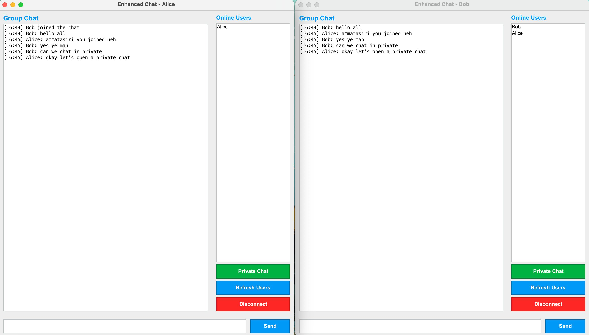
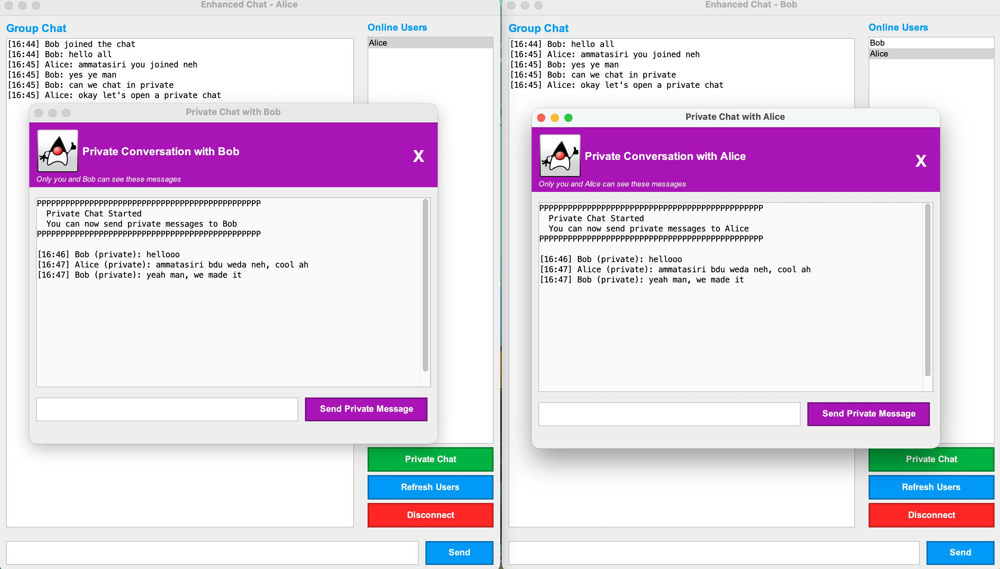

# Enhanced Multi-Client Chat Application

[](https://github.com/mrcentimetre/multiclient-chat-app/releases/latest)
[](LICENSE.txt)
[](https://www.oracle.com/java/)

A production-ready Java chat application demonstrating advanced socket programming, multi-threading, and real-time communication. Features include group messaging, private chat, and a professional GUI - all built from scratch.

## Screenshots

### Main Chat Interface

*Multiple clients connected with group chat and online users list*

### Private Chat Feature

*Secure one-to-one private messaging between users*

## Download & Quick Start

### Option 1: Download Pre-built Release (Easiest)

1. **Download** the latest release from the [Releases](../../releases) page
2. **Extract** the ZIP file to your desired location
3. **Run** the application:

   **Start Server:**
   ```bash
   # Windows
   run-server.bat

   # Mac/Linux
   ./run-server.sh
   ```

   **Start Client:**
   ```bash
   # Windows
   run-client.bat

   # Mac/Linux
   ./run-client.sh
   ```

4. **Login** with any username and start chatting!

### Option 2: Build from Source

See [Setup and Installation](#setup-and-installation) section below.

### Requirements
- Java 8 or higher installed on your system
- No additional dependencies needed!

## 📋 Table of Contents
- [Download & Quick Start](#download--quick-start)
- [Screenshots](#screenshots)
- [Overview](#overview)
- [Features](#features)
- [System Architecture](#system-architecture)
- [Setup and Installation](#setup-and-installation)
- [How to Run](#how-to-run)
- [How to Use](#how-to-use)
- [Project Structure](#project-structure)
- [Technical Details](#technical-details)
- [Private Chat Feature](#private-chat-feature)
- [Testing Guide](#testing-guide)
- [Troubleshooting](#troubleshooting)

## 🎯 Overview

A comprehensive chat application demonstrating advanced network programming concepts including TCP sockets, multi-threading, client-server architecture, and real-time data streaming. Built from scratch using Java Socket Programming.

**Key Features Demonstrated:**
- Real-time client-server communication using Java sockets
- Multi-threaded server handling multiple clients simultaneously
- Custom message protocol for efficient data exchange
- Professional GUI development with Java Swing
- Advanced private messaging with intelligent message routing

## ✨ Features

### Core Features
- ✅ **Multi-Client Support**: Server handles multiple clients concurrently
- ✅ **Real-Time Messaging**: Instant broadcast messaging to all connected users
- ✅ **Private Chat**: One-to-one private messaging between users
- ✅ **User Authentication**: Username-based login with validation
- ✅ **Online Users List**: View all currently connected users
- ✅ **Chat History Logging**: Server maintains chat history logs
- ✅ **Professional UI**: Modern Swing-based graphical interface
- ✅ **System Notifications**: Join/leave notifications for all users

### Technical Features
- Multi-threaded architecture (one thread per client)
- Thread-safe client management using ConcurrentHashMap
- Structured message protocol with type-based routing
- Graceful connection handling and error recovery
- Input validation and error messages

## 🏗️ System Architecture

```
┌─────────────────────────────────────────────────────────────┐
│                         SERVER                              │
│                    (Multi-threaded)                         │
│  ┌──────────────────────────────────────────────────────┐  │
│  │ ServerSocket (Port 5000)                             │  │
│  │ - Accepts client connections                         │  │
│  │ - Creates ClientHandler thread per client            │  │
│  │ - Routes messages (broadcast & private)              │  │
│  │ - Manages connected clients map                      │  │
│  └──────────────────────────────────────────────────────┘  │
└─────────────────────────────────────────────────────────────┘
                            │
        ┌───────────────────┼───────────────────┐
        │                   │                   │
    ┌───▼───┐          ┌───▼───┐          ┌───▼───┐
    │Client1│          │Client2│          │Client3│
    │       │          │       │          │       │
    │ Alice │          │  Bob  │          │Charlie│
    └───────┘          └───────┘          └───────┘
```

### Message Flow (Private Chat Example)

```
Alice sends private message "Hi" to Bob:

[Alice's PrivateChatUI]
    ↓
[Client.sendPrivateMessage("Bob", "Hi")]
    ↓
    Send: "PRIVATE|Alice|Bob|Hi"
    ↓
[Server receives in ClientHandler]
    ↓
[Server.sendPrivateMessage(message)]
    ↓
    Find Bob's ClientHandler
    ↓
[Bob's ClientHandler receives]
    ↓
[Bob's ClientListener]
    ↓
[Bob's PrivateChatUI displays "Alice: Hi"]
```

## 🛠️ Setup and Installation

### Prerequisites
- Java Development Kit (JDK) 8 or higher
- Terminal/Command Prompt
- Basic understanding of Java and networking concepts

### Verify Java Installation
```bash
java -version
javac -version
```

### Build from Source

**Quick Build:**

On Mac/Linux:
```bash
./build.sh
```

On Windows:
```bash
build.bat
```

This will:
- Compile all Java source files
- Create executable JAR files in the `dist/` folder
- Generate `ChatServer.jar` and `ChatClient.jar`

**Run After Building:**
```bash
# Server
java -jar dist/ChatServer.jar

# Client
java -jar dist/ChatClient.jar
```

### Create Release Package

To create a distributable ZIP package:

On Mac/Linux:
```bash
./create-release.sh
```

On Windows:
```bash
create-release.bat
```

This creates a `release/enhanced-chat-app-v1.0.0.zip` file containing:
- Pre-built JAR files
- Launch scripts for all platforms
- User documentation
- Everything needed to run the app

### Project Structure
```
multiclient-chat-app/
├── src/
│   ├── common/              # Shared classes
│   │   ├── Constants.java   # Configuration constants
│   │   ├── MessageType.java # Message type enum
│   │   └── Message.java     # Message data class
│   │
│   ├── server/              # Server-side code
│   │   ├── Server.java      # Main server class
│   │   ├── ClientHandler.java # Per-client handler
│   │   └── PrivateChatHandler.java # (Placeholder)
│   │
│   ├── client/              # Client-side code
│   │   ├── Client.java      # Client networking
│   │   ├── ClientListener.java # Message receiver
│   │   │
│   │   ├── ui/              # User interfaces
│   │   │   ├── LoginUI.java        # Login screen
│   │   │   ├── ChatClientUI.java   # Main chat window
│   │   │   └── PrivateChatUI.java  # Private chat window
│   │   │
│   │   └── utils/           # Utilities
│   │       └── UIUtils.java # UI helper methods
│   │
│   └── logs/                # Log files directory
│       └── chat_history.txt
│
├── bin/                     # Compiled classes (created on build)
├── docs/                    # Documentation
└── README.md
```

## 🚀 How to Run

### Step 1: Compile the Project

```bash
# Navigate to project directory
cd multiclient-chat-app

# Create bin directory if it doesn't exist
mkdir -p bin

# Compile all source files
javac -encoding UTF-8 -d bin src/common/*.java src/server/*.java src/client/*.java src/client/ui/*.java src/client/utils/*.java
```

### Step 2: Start the Server

Open a new terminal window:

```bash
cd multiclient-chat-app
java -cp bin server.Server
```

You should see:
```
╔═══════════════════════════════════════════════╗
║   Enhanced Chat Server Started Successfully  ║
╚═══════════════════════════════════════════════╝
Server listening on port: 5000
Maximum clients: 50
Waiting for client connections...
```

### Step 3: Start Client(s)

Open additional terminal windows (one per client):

**Client 1:**
```bash
cd multiclient-chat-app
java -cp bin client.ui.LoginUI
```

**Client 2:**
```bash
cd multiclient-chat-app
java -cp bin client.ui.LoginUI
```

**Client 3:**
```bash
cd multiclient-chat-app
java -cp bin client.ui.LoginUI
```

## 📖 How to Use

### Login
1. Enter a username (3-20 alphanumeric characters)
2. Server host is pre-filled as `localhost`
3. Server port is pre-filled as `5000`
4. Click "Connect" or press Enter

### Group Chat
1. Type your message in the text field at the bottom
2. Click "Send" or press Enter
3. Your message will be broadcast to all connected users

### Private Chat

**Method 1: Using the Button**
1. Select a user from the "Online Users" list on the right
2. Click "Private Chat" button
3. A new window opens for private conversation
4. Type your private message and send

**Method 2: Double-Click**
1. Double-click on a username in the "Online Users" list
2. Private chat window opens automatically

**Private Chat Window Features:**
- Purple header indicates private chat
- Only you and the recipient can see messages
- Separate window per conversation
- Send messages using "Send Private Message" button
- Close button (X) to close the private chat

### Commands
- **Refresh Users**: Click to update the online users list
- **Disconnect**: Properly disconnect from the server

## 🔧 Technical Details

### Network Configuration
- **Protocol**: TCP/IP
- **Server Port**: 5000
- **Connection Type**: Persistent socket connections
- **Threading Model**: One thread per client

### Message Protocol

Messages are formatted as: `TYPE|SENDER|RECIPIENT|CONTENT`

**Examples:**
```
BROADCAST|Alice||Hello everyone       # Group chat message
PRIVATE|Alice|Bob|Hey Bob!            # Private message
SYSTEM|SERVER||User joined            # System notification
USER_LIST|SERVER||Online users: Alice, Bob
```

### Message Types
- `BROADCAST` - Message to all users
- `PRIVATE` - One-to-one message
- `SYSTEM` - Server notification
- `JOIN` - User joined
- `LEAVE` - User left
- `USER_LIST` - List of online users
- `ERROR` - Error message

### Key Classes and Methods

**Server Side:**
- `Server.java:179` - `sendPrivateMessage()` - Routes private messages
- `ClientHandler.java:149` - `handleMessage()` - Processes message types
- `Server.java:111` - `registerClient()` - User authentication

**Client Side:**
- `Client.java:116` - `sendPrivateMessage()` - Sends private message
- `ClientListener.java:34` - `run()` - Listens for server messages
- `ChatClientUI.java:354` - `handlePrivateMessage()` - Routes incoming private messages
- `PrivateChatUI.java:178` - `handleSendMessage()` - Sends private message

## 🎯 Private Chat Feature

### How It Works

1. **User Selection**: User selects recipient from online users list
2. **Window Creation**: PrivateChatUI window opens for that recipient
3. **Message Sending**:
   - User types message
   - `client.sendPrivateMessage(recipient, content)` is called
   - Message formatted as `PRIVATE|sender|recipient|content`
   - Sent to server via socket

4. **Server Routing**:
   - Server receives message in `ClientHandler`
   - Identifies it as PRIVATE type
   - Calls `server.sendPrivateMessage()`
   - Finds recipient's ClientHandler in clients map
   - Sends to recipient ONLY
   - Also sends back to sender (for confirmation)

5. **Message Display**:
   - Recipient's `ClientListener` receives message
   - Routes to `ChatClientUI.handlePrivateMessage()`
   - Opens/updates PrivateChatUI window
   - Displays message with timestamp

### Key Implementation Files

**Frontend (Client):**
- `PrivateChatUI.java` - Private chat window UI
- `ChatClientUI.java` - Manages private chat windows in a HashMap

**Backend (Server):**
- `Server.java` - Private message routing logic
- `ClientHandler.java` - Message type handling

**Networking:**
- `Client.java` - `sendPrivateMessage()` method
- `Message.java` - Message serialization/deserialization

## 🧪 Testing Guide

### Test Scenario 1: Basic Connection
1. Start server
2. Start 2 clients
3. Login as "Alice" and "Bob"
4. Verify both see system notifications
5. Verify online users list shows both names

### Test Scenario 2: Group Chat
1. Alice sends "Hello everyone"
2. Verify Bob receives the message
3. Bob sends "Hi Alice"
4. Verify Alice receives the message

### Test Scenario 3: Private Chat
1. Alice clicks "Private Chat" and selects Bob
2. Alice sends "Hey Bob, this is private!"
3. Verify:
   - Bob receives message in private window
   - Message appears in Alice's private window too
   - No other users see this message

### Test Scenario 4: Multiple Private Chats
1. Start 3 clients: Alice, Bob, Charlie
2. Alice opens private chat with Bob
3. Alice opens private chat with Charlie
4. Send messages in both windows
5. Verify messages go to correct recipients

### Test Scenario 5: Disconnection
1. Alice disconnects
2. Verify all users see "Alice left the chat"
3. Verify Alice removed from online users list
4. Bob tries to send private message to Alice
5. Verify Bob receives error "User 'Alice' is not online"

### Test Scenario 6: Username Validation
1. Try to login with username < 3 characters
2. Try to login with username > 20 characters
3. Try to login with special characters
4. Try to login with existing username
5. Verify appropriate error messages

## 🐛 Troubleshooting

### Server Won't Start
**Problem:** "Address already in use"
**Solution:** Port 5000 is occupied. Kill existing process or change port in Constants.java

```bash
# Find process using port 5000 (Mac/Linux)
lsof -i :5000

# Kill the process
kill -9 <PID>
```

### Client Can't Connect
**Problem:** "Connection refused"
**Solutions:**
1. Verify server is running
2. Check server host and port in login screen
3. Check firewall settings
4. Verify network connectivity

### Private Chat Window Not Opening
**Problem:** Click on "Private Chat" but nothing happens
**Solutions:**
1. Verify a user is selected in the list
2. Check console for error messages
3. Verify recipient is still online
4. Try refreshing users list

### Messages Not Displaying
**Problem:** Messages sent but not received
**Solutions:**
1. Check server console for routing logs
2. Verify both clients are connected
3. Check for compilation errors
4. Restart server and clients

### Compilation Errors
**Problem:** Character encoding errors
**Solution:** Use UTF-8 encoding flag:
```bash
javac -encoding UTF-8 -d bin src/...
```

## 📚 Learning Resources

### Concepts Demonstrated
1. **Socket Programming**: TCP client-server communication
2. **Multi-threading**: Concurrent client handling
3. **Thread Safety**: ConcurrentHashMap usage
4. **I/O Streams**: BufferedReader, PrintWriter
5. **GUI Programming**: Java Swing components
6. **Design Patterns**: Observer pattern (message handling)
7. **Protocol Design**: Custom message protocol

### Files to Study
- Start with `Message.java` - understand data structure
- Then `Constants.java` - see configuration
- Study `Server.java` - understand server architecture
- Review `ClientHandler.java` - see thread handling
- Examine `Client.java` - understand client networking
- Finally UI files - see user interface implementation

## 👨‍💻 Developer

**Developed by:** [mrcentimetre](https://github.com/mrcentimetre)

This project showcases:
- Complete full-stack application development (server + client)
- Advanced Java socket programming and networking
- Multi-threaded architecture design and implementation
- Professional GUI design with Java Swing
- Custom protocol design and implementation
- Production-ready software packaging and distribution

## 📝 License

MIT License - See [LICENSE.txt](LICENSE.txt) for details.

This project is open source and available for educational purposes.

## 🎓 Project Background

Created as a demonstration of advanced network programming concepts learned at the University of Moratuwa. The application implements industry-standard practices for:
- Socket-based client-server communication
- Concurrent connection handling
- Message routing and protocol design
- Cross-platform deployment

---

## 🚦 Quick Start Summary

```bash
# 1. Compile
javac -encoding UTF-8 -d bin src/common/*.java src/server/*.java src/client/*.java src/client/ui/*.java src/client/utils/*.java

# 2. Start Server (Terminal 1)
java -cp bin server.Server

# 3. Start Client (Terminal 2, 3, 4...)
java -cp bin client.ui.LoginUI

# 4. Login with usernames like: Alice, Bob, Charlie

# 5. Try Private Chat!
```

---

## 📦 Publishing to GitHub Releases

To publish your app for download on GitHub:

1. **Build the release package:**
   ```bash
   ./create-release.sh    # Mac/Linux
   # or
   create-release.bat     # Windows
   ```

2. **Push your code to GitHub:**
   ```bash
   git add .
   git commit -m "Release v1.0.0"
   git push origin main
   ```

3. **Create a GitHub Release:**
   - Go to your repository on GitHub
   - Click "Releases" → "Create a new release"
   - Tag version: `v1.0.0`
   - Release title: `Enhanced Chat App v1.0.0`
   - Description: Copy from the features section above
   - Upload the file: `release/enhanced-chat-app-v1.0.0.zip`
   - Click "Publish release"

4. **Share the download link:**
   - Your app will be available at:
   - `https://github.com/mrcentimetre/multiclient-chat-app/releases/latest`
   - Users can download the ZIP and run it directly!

### What Users Get

When someone downloads your release ZIP, they get:
- ✅ Pre-built JAR files (no compilation needed)
- ✅ Easy-to-use launch scripts (just double-click)
- ✅ Complete documentation
- ✅ Ready to run on Windows, Mac, or Linux

---

## ⭐ Show Your Support

If you find this project useful, please consider giving it a star on GitHub!

## 🤝 Contributing

Contributions, issues, and feature requests are welcome! Feel free to check the [issues page](https://github.com/mrcentimetre/multiclient-chat-app/issues).

## 📫 Connect

- GitHub: [@mrcentimetre](https://github.com/mrcentimetre)
- Project Link: [https://github.com/mrcentimetre/multiclient-chat-app](https://github.com/mrcentimetre/multiclient-chat-app)

---

**Made with ❤️ using Java Socket Programming**
